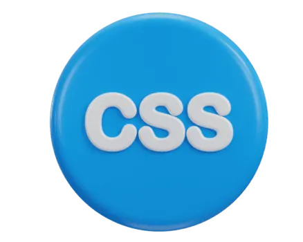
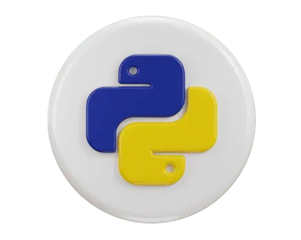

1- Screenshot/Logo:

2- Your game's name:
  A) Name: Sayed Isa Hashim ISa Yusuf Alhashimi
  B) Descripe: The game consists of a ring of cards, with each pair of cards bearing the same image (each pair of identical images forms a "pair"). These cards are placed on a table or screen.
  C) Goal: It is to find all the matching pairs of pictures by flipping over just two cards in each turn.
  D) why you chose: practice good for ming, help work mind for improve focuss and memorize things.

  
3- Getting started:
  A) Deploy Link: https://esalhashimi.github.io/Memorize-Game/
  B) Rule: need find all picture simmulate flip befor Attemps to 15
  C) Planing Link: https://github.com/esalhashimi/Structure-Plan-Unit1

4) Attributions:
   A) CSS: <link rel="stylesheet" href="./css/style.css">
   B) JS:  
   C) LOGO:  <link rel="Icon" href="./assets/LOGO.png">
   D) Background: background:url("../assets/background.jpg");
   E) Back-Card:  
   F) CSS Image: 
   G) HTML Image: 
   H) JS Image: 
   I) php Image: 
   J) python Image: 
   K) SQL Image: 
   L) Click sound: audio.src = "./assets/sound/click.wav";
   M) win sound:  audio.src = "./assets/sound/win.wav";
   N) Lose sound  audio.src = "./assets/sound/lose.mp3";
   O) Reset sound  audio.src = "./assets/sound/Reset.wav";

6) Technologies used:
     A) HTML: Provides the basic layout (game board, cards, timer, button, and modal).
     B) CSS: Controls the look, colors, and arrangement. Includes 3D card-flipping animations and media queries for responsive design on mobile devices.
     C) JS: Implements all the functionality, including card matching, shuffling, score/attempt tracking, timer functionality, game state management (Win/Loss), and audio control.

          JS Fanction:
               1) playSound: control the sound
                2) startTimer: controll the timer
                 3) Attemps: count the Attemps
                  4) shuffleCards: random the card
                   5) handleGameOver: after Finish the game
                    6) handleCardClicked: after click
                    7) init: before game

8) Next steps:
  A) improve the design and response for devices.
   B) make many level and more defeculty.
   C) can play online with freinds, who finish first.

